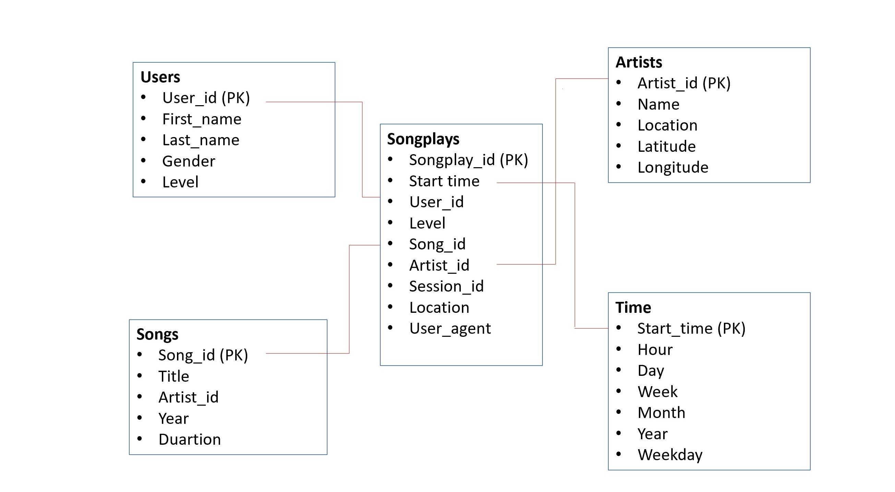

# Building a data warehouse for Sparkify in Amazon Redshift

## The goal of the project
The goal of this project is to create a data warehouse for the startup called Sparkify which has rolled out a new music streaming app to the market. The management and the analyst team of the company is curious about to which songs their users listen the most. 
The company provided me, their data engineer, 2 different datafiles:
- the log data file that contains the users' activity collected by the app;
- the song data file that contains metadata of the songs streamed by the app.
Both data files are JSON files and are saved in the Amazon S3 buckets as follows:
Song data: *s3://udacity-dend/song_data*
Log data: *s3://udacity-dend/log_data*

My job is to access the data files , copy them from the S3 buckets into staging tables in my Redshift database as well as to transform and to load them from tha staging tables into the fact and dimension tables designed in my Redshift Data Warehouse. 

## The schema
As in a Kimball's data warehouse in general, the data is stored in a dimensional database. The schema of the database can be seen in the figure below.

The fact table is called songplays that contains 9957 records of events. Tha fact table stores data of users, of events user listened to music with the app, and of facts of songs and artists. The dimension tables contain metadata of Sparkify's users, of songs and artists as well as dates and times users listened to their music. User table is populated with 104 users, artist table with 9553 artists, song table with 14896 songs and time table with .... events. 

Because the data base can be considered to be small, all the 4 distribution styles in Amazon Redshift may result similar query performance. Therefore, I chose the default AUTO distribution style in which Redshift assigns an optimal distribution style based on the size of the data tables.

## The Redshit cluster

To build the desired data warehouse, I set up a Redshift cluster in the *us-west-2* region. The multi-node cluster is made of one lead and four dc2.large type compute nodes. I managed creating the cluster by running the cells of *create_cluster.ipynb* file. Befor doing so, I had to run *create IAM.ipynb* to create the *dwhRole* IAM role that was assigned to the Redshift cluster. Admin policy and AmazonS3ReadOnly policy was attached to *dwhRole*. All information in relation to the IAM role, the cluster, the S3 buckets and the user is saved in the configuration file called *dwh.cfg*. All programs that need any information of them read the necessary data from the config file.   

## The files in the repository
In the previous section I mentioned *create IAM.ipynb* and *create_cluster.ipynb* files. To design the tables presented in the dimensional model, we run *create_tables.py*. This program drops all the existing tables and creates the new fact and dimensional tables as well as the temporary staging tables. We run *etl.py* to populate first the staging tables then the fact and dimension tables. Both *create_tables.py* and *etl.py* are based on *sql_queries.py*. In this file, I designed sql queries that are grouped by their use. The group of sql queries are imported when running *create_tables.py* or *etl.py*. 

The first query group in *sql_queries.py* is DROP TABLES. It is useful when redisignig the schema or when making any changes in the data tables. Dropping and creating new tables is an effective way to restart the database. 
The next group is CREATE TABLES. The queries of the group manage to design the tables specifying the columns and the data types of each column.
STAGING TABLES is the next group. We copy the data from the S3 buckets to the staging tables. To do so, we need to provide the credentials to access the S3 buckets and the IAM role. Because the *log_data* stored in the S3 bucket is a more complex JSON file, we also need the S3 bucket to the  JSONpath file. I used the link below to help me designing that part of the program. 
https://docs.aws.amazon.com/redshift/latest/dg/r_COPY_command_examples.html#r_COPY_command_examples-copy-from-json

FINAL TABLES contains the SQL queries used by *etl.py* to extract, transform and load the data from the staging tables to the final fact and dimension tables. *songs*, *artists* tables use the data of the *staging_songs* table whereas *users* and *time* tables use the data pulled from *staging_events_table*. *songplays* gets its data of both staging tables. To populate the *times* dimension table, we not only copy the data from the staging table but transform it using the EXTRACT method.  

The last group in *sql_queries.py* is QUERY LISTS that contains of lists made up of queries detailed above and are imported in *create_tables.py* and *etl.py*. 

## How to design the data base with running the programs?
As mentioned above, I run the cells in *CreateIAM.ipynb* to create the IAM role called *dwhRole* and to get the ARN of the role that I copy to the config file.
The next step is to create the cluster running the cells of *create_cluster.ipynb*. The first step when creating the cluster is to create clients to EC2, Amazon S3 and Amazon Redshift. To be able to do it, I have to generate a user to Redshift first and to attach Admin and AmazonS3ReadOnlyAccess policies to the user. When the cluster's status turns *available* in the Amazon Redshift console, I can access the cluster endpoint that I copy to the config file as HOST. We need to access those credentials (host, database name, user pswd etc) to design the data tables in the data base.

Once the database is ready to use, we run *create_tables.py*. This program drops the existing tables from the database and creates the temporary staging tables as well as the final fact and dimension tables. Then it comes to run *etl.py* that firstly copies the data from the S3 buckets and then populates the fact and dimension tables from the staging tables whilst transforming the data if necessary. 

## Testing the database
After finishing the design of the data warehouse, I tested the database by SQL queries. I wanted to be sure that all the tables contain the right sort of data and that joins of different dimension tables and the fact table can be carried out when executing a more complex query. I also wanted to check the size of the data tables and whether there are any unnecessary duplicates in the tables. I ran the test quesries in the Amazon Redshift console.

Sample queries, screenshot of the console
