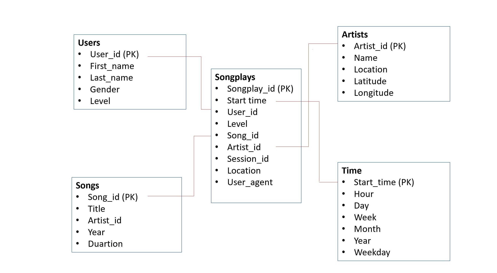
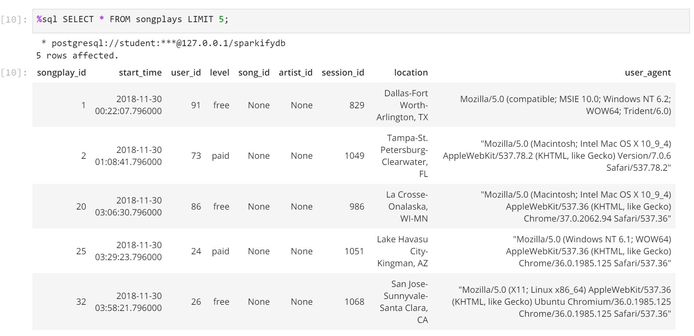
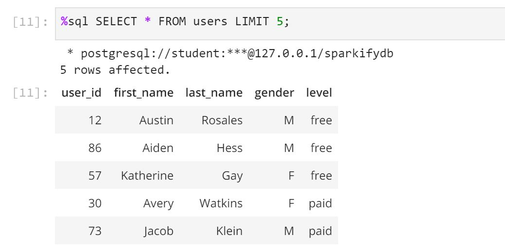
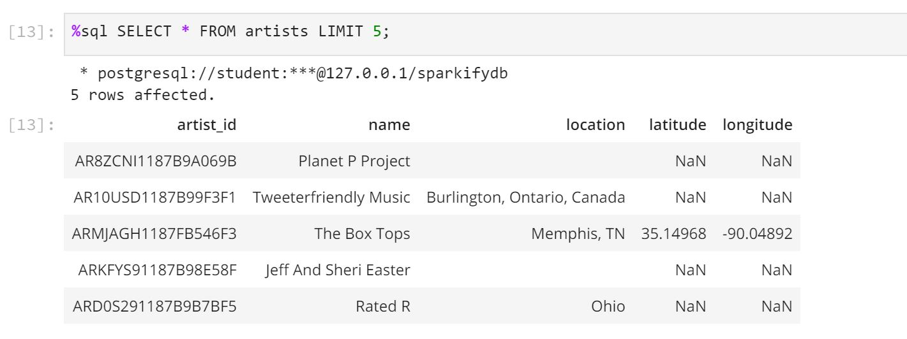

### The project

The goal of this project was to create a database for the startup called Sparkify which had brought a new music streaming app to the market. The management and the analyst team of the company were curious about to what songs their user listen the most. 
When asking me, the company had 2 different datafiles:
- the log data file that contains the users' activity collected by the app;
- the song data file that contains metadata of the songs streamed by the app.
Both data files are made of JSON files. My job was to access the data stored in the JSON files and to design an ETL pipeline that makes is possible to load them into a database in which the analyst team can retrieve the data using SQL queries easily.

### The schema description

I designed a star schema before creating the database. The fact table is called SONGPLAYS, the dimension tables are USERS, SONGS, ARTISTS and TIME. The star schema can be investigated in the diagram below.

It is easy to spot that all the primary keys of the dimension tables are foreign keys in the fact table so pulling the data using SQL joins is easy. Also, if the analyst team does not requires a wider range of data features, the data can be pulled out from the fact table.
When designing the star schema, I tried to pay attention of setting restrictions, e.g. primary keys must not be NULLs. If the restrictions were violated when populating the data tables, I applied the ON CONFLICT method. For primary keys I asked to update the data that was to insert into the tables, in other cases I asked not to do anything.

### Files in the repository
Whilst creating the ETL pipeline, my job was to 
1. create the database, the different data tables using Python and PostgreSQL;
2. access the data in the log files and the song files and open them;
3. load the data into the data tables;
4. check the database carying out some SQL queries.

Firstly, I wrote the script to the **sql_queries.py** file that contains the SQL scripts for dropping, creating the different tables and for inserting the data into them. The file also contains 2 lists of different SQL queries that can be imported when running the other files will be described below.

The **create_tables.py** file contains functions written in Python and using the *psycopg2* package and the mentioned SQL query lists. Those functions can be called to create the database, to create the data tables in the database or to drop the data tables if necessary.  

Before designing the final version of ETL pipeline that loads larger amount of data into the tables, I worked out the main structure of the pipeline (found in the **etl.ipynb** notebook), in which I loaded only one file from the song and the log files. In this workbook I opened the data files, chose only one of them, transformed them into pandas dataframes and chose the different features to populate the recently created datatables. I used the song data file to fill up the *songs* and *artists* tables, the log data files to fill the *users* and *time* tables. To populate the fact table, I had to use both the log file and the data tables in the database which seems to be obvious because the fact table contains lot of features including all the primary keys from the dimension tables.

After checking the pipeline on a smaller scale of data, I moved and transfomed the pipeline to be able to handle the larger amount of data too. This can be found in the *etl.py* program. In this program I redesigned the pipeline to manage opening all the files and loading all the data from the log and song files.

### How to run the scripts?
It is important to run the different files in the right order. Before putting the pipline into action, we need to run the *create_tables.py* program in the command line. That makes *sqi_queries.py* working, too. After running the mentioned code, *etl.py* can be run as well, that will create and populate the data tables.

### Testing the pipleline
To test my ETL pipeline, I ran the **test.ipynb** file to carry out some SQL quesries and to check whether the retrieved data is the one what it was supposed to be.

Finally, you can find some examples of the test queries below:

The first example is the result of a query from the fact table.

The next one is a query from the dimension table called *users*.

The last one is a query from the dimensiom table called *artists*.

